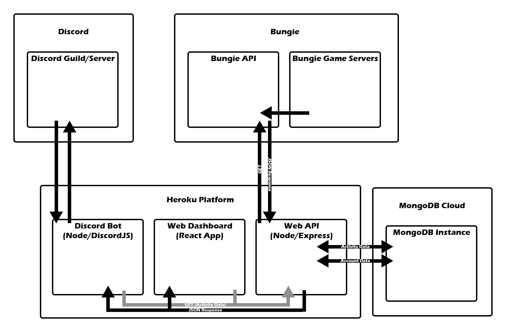

## Overview
For my ePortfolio project I wanted to expand upon concepts and programs I have worked on in the past that support a Discord community I am a part of. In short, there are two front-facing pieces and a backend support system. Part one is a Discord bot that can receive commands to fetch and return data from the backend API in a clean and readable form. The second is a web-based dashboard that displays the data in more processed ways such as activity history lists and charts. The third system is a standalone API that handles calls to and from the Discord bot and dashboard. It also handles sourcing the data from Bungie’s online API that provides tons of player data from their online shooter Destiny 2. I have done numerous Discord bots in the past, but never supplemented them with a web accessible dashboard. I have also worked with the Bungie API with other projects, so I know its nuances well at this point. I had never created my own API server endpoints but had very much been wanting to learn.

To expand on the application requires a breakdown of the available data accessed. Within the game, players partake in activities. They may be story missions, strike missions, player vs. player matches, or large 6-player raid encounters. The final stats for all activities are available in Bungie's API accessible with proper API access tokens. Each activity a player completes creates its own entry per character (a player account can have up to 3 characters on it). You can also do more with proper permissions including requesting elevated player account permissions from the user to move weapons and equipment between characters to speed along common inventory management. This is beyond the scope of this project but demonstrates the power of the API made available.
 
## Software Design/Engineering
Much of the project falls into this category as all three must work together to access and display requested by the user. The Discord bot uses proper frameworks (Node/DiscordJS) to listen for commands on the Discord server(s) it belongs to. It must then make calls to the proper custom API endpoints pertaining to the data the Discord user requested. The dashboard must also do the same to access the data but also display it on a web page utilizing the React framework. It also stores session data in a MongoDB database. Lastly the custom API uses NodeJS/Express to make requested data available via separate endpoints. It also utilizes MongoDB to store fetched data and user information (Discord ID/Bungie account ID and character IDs).

## Databases
A MongoDB instance was used to store user session data in the web dashboard. This will prevent the user from having to login/authorize with Discord every time they visit the dashboard. The backend Express server also utilizes a collection to store user account IDs. Since a Discord bot is part of the deployment, I must be able to associate a Discord User ID with a Bungie Account ID to lookup the correct account and get activity stats. I also look up the character IDs belonging to the Bunge Account the first time and store those values to save on redundant calls to the Bungie API during development. This does present a problem if a user deletes a character, but one that is easily solvable once the project is more complete. Activity data that is fetched will also be stored in the event I want to display aggregate data and not just individual account activity statistics. This could be part of an ongoing feature development beyond the scope of this project as I intend to use these applications to better the communities I am part of.
 
## Algorithms and Data Structures
These applications rely heavily on Javascript’s Promise algorithm specifications. These are used in instances where data is fetched or read from a remote resource and return a Promise object with callbacks. The callbacks are executed once the data has (or has not) successfully been returned. On top of this, mapped data must be kept in memory when accessing hashed data from the Bungie API. Activity data is returned with common values such as activity names and stats names as hash ID numbers. These numbers are intended to be looked up and referenced from a downloadable manifest JSON. This JSON allows Bungie to update data on their end such as names and descriptions while keeping it encapsulated from implementations. Hashed data can be requested from the API but is meant to be referenced from the manifest file especially if there are numerous values you intend to reference.
 
## Application Flowchart

