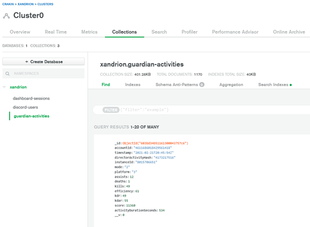

## Project
---
[Xandrion Data API](https://github.com/CrakinDev/xandrion2-api)

[Xandrion Dashboard](https://github.com/CrakinDev/xandrion2-dashboard)

## Artifact
---
The artifact for this enhancement category is the Express-based NodeJS API server again. Its main purpose is to be a one-stop shop for both the Discord bot and web Dashboard’s to source data. This ensures the data is centrally located and both applications use and handle the same data through common accessing means. This enhancement addresses actual fetching of player activity data and storing it to a collection in the Mongo database under the “guardian-activities” collection.

The initial creation was just after the Discord bot during week 1 of the term. It was setup as a working listening server, but without any useful developed endpoints or database accessing logic. It was then enhanced as part of the Milestone Three requirements to add endpoints for the bot/dashboard to access.

## Improvements
---
The improvements made were mainly fetching/handling the data of the activities endpoint. The data must be fetched from the Bungie API, processed, and then stored to the Mongo database.

Enhancement two created the activities endpoint. This endpoint used the associated account data to lookup activity results from the type specified. This endpoint now uses the “GetActivityHistory” Bungie API endpoint to fetch data pertaining to all characters. The JSON response is now parsed for the relevant data we want to keep. An object is created for each individual activity returned with the values kept encapsulated. These objects are then pushed into an array until all returned activities are parsed. Once completed, the array is then written to the Mongo database, stringified and returned as a response to the requesting application.
Example Activity Response from Bungie API (single activity, each activity has an entry in the activities array of the response):

```json
"Response":{
         "activities":[
            {
               "period":"2021-03-25T02:32:49Z",
               "activityDetails":{
                  "referenceId":1754609040,
                  "directorActivityHash":1754609040,
                  "instanceId":"8211739124",
                  "mode":3,
                  "modes":[
                     7,
                     3,
                     18
                  ],
                  "isPrivate":false,
                  "membershipType":3
               },
               "values":{
                  "assists":{
                     "statId":"assists",
                     "basic":{
                        "value":26,
                        "displayValue":"26"
                     }
                  },
                  "completed":{
                     "statId":"completed",
                     "basic":{
                        "value":1,
                        "displayValue":"Yes"
                     }
                  },
                  "deaths":{
                     "statId":"deaths",
                     "basic":{
                        "value":1,
                        "displayValue":"1"
                     }
                  },
                  "kills":{
                     "statId":"kills",
                     "basic":{
                        "value":46,
                        "displayValue":"46"
                     }
                  },
                  "opponentsDefeated":{
                     "statId":"opponentsDefeated",
                     "basic":{
                        "value":72,
                        "displayValue":"72"
                     }
                  },
                  "efficiency":{
                     "statId":"efficiency",
                     "basic":{
                        "value":72,
                        "displayValue":"72.00"
                     }
                  },
                  "killsDeathsRatio":{
                     "statId":"killsDeathsRatio",
                     "basic":{
                        "value":46,
                        "displayValue":"46.00"
                     }
                  },
                  "killsDeathsAssists":{
                     "statId":"killsDeathsAssists",
                     "basic":{
                        "value":59,
                        "displayValue":"59.00"
                     }
                  },
                  "score":{
                     "statId":"score",
                     "basic":{
                        "value":0,
                        "displayValue":"0"
                     }
                  },
                  "activityDurationSeconds":{
                     "statId":"activityDurationSeconds",
                     "basic":{
                        "value":650,
                        "displayValue":"10m 50s"
                     }
                  },
                  "team":{
                     "statId":"team",
                     "basic":{
                        "value":0,
                        "displayValue":""
                     }
                  },
                  "completionReason":{
                     "statId":"completionReason",
                     "basic":{
                        "value":0,
                        "displayValue":"Objective Completed"
                     }
                  },
                  "fireteamId":{
                     "statId":"fireteamId",
                     "basic":{
                        "value":-3354171868466016000,
                        "displayValue":"-2147483648"
                     }
                  },
                  "startSeconds":{
                     "statId":"startSeconds",
                     "basic":{
                        "value":1,
                        "displayValue":"0m 1s"
                     }
                  },
                  "timePlayedSeconds":{
                     "statId":"timePlayedSeconds",
                     "basic":{
                        "value":649,
                        "displayValue":"10m 49s"
                     }
                  },
                  "playerCount":{
                     "statId":"playerCount",
                     "basic":{
                        "value":3,
                        "displayValue":"3"
                     }
                  },
                  "teamScore":{
                     "statId":"teamScore",
                     "basic":{
                        "value":0,
                        "displayValue":"0"
                     }
                  }
               }
            }
```
Example Activity Entry:


## Objectives
---
All original objectives were met, though if additional data wants to be fetched or kept from the activity fetch, the database schema would have to be modified. This can be easily done by modifying the database schema object in the application API when fetching data from the database. The applications are then free to use the added data in the response. This makes scalability much easier.
 
## Reflection
---
I have been thoroughly enjoying the simplicity of MongoDB in general and the ease of use when integrating into web applications. Using simple database schemas in a accessing applications also ensures accessing data is kept tidy and scalable. My next milestone/narrative will include the dashboard which should tie the entire application together. The final submission will also include screenshots of processing/usage of the application so that it can all be visualized since accessing anything relevant requires a Discord account, but more importantly, actual activity in the game itself.


